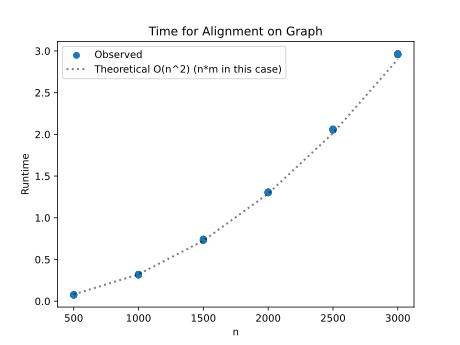
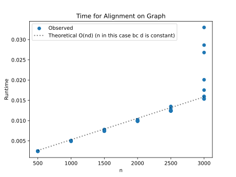

# Project Report - Alignment

## Baseline

### Design Experience

I worked with Brandon Monson and Porter Schollenberger to design an unrestricted global alignment using Needleman–Wunsch. We planned a full (n+1)×(m+1) dynamic programming table with separate backpointers, simple linear gap penalties (no affine open), and a traceback from (n,m) to build the aligned strings. We chose clarity over micro-optimizations to make correctness and debugging straightforward.

### Theoretical Analysis - Unrestricted Alignment

#### Time

```py
n, m = len(seq1), len(seq2)

# allocate DP and backpointer tables
editCostTable = [[0]*(m+1) for _ in range(n+1)]                                   #            O(nm): allocate and zero-initialize
backPointerTable = [[""]*(m+1) for _ in range(n+1)]                                #            O(nm): allocate backpointers

# initialize first column / first row (global alignment borders)
for i in range(1, n + 1):                                                          #            O(n)
    editCostTable[i][0] = editCostTable[i-1][0] + indel_penalty
    backPointerTable[i][0] = "U"
for j in range(1, m + 1):                                                          #            O(m)
    editCostTable[0][j] = editCostTable[0][j - 1] + indel_penalty
    backPointerTable[0][j] = "L"

# fill DP matrix
for i in range(1, n + 1):                                                          #            O(n)
    for j in range(1, m + 1):                                                      #            O(m) → nested ⇒ O(nm)
        diagonal = editCostTable[i-1][j-1] + (match_award if seq1[i-1]==seq2[j-1]
                                              else sub_penalty)                    #            O(1)
        left     = editCostTable[i][j-1] + indel_penalty                           #            O(1)
        up       = editCostTable[i-1][j] + indel_penalty                           #            O(1)
        # choose min and record backpointer
        cost, _, direction = min([(diagonal,0,"D"), (left,1,"L"), (up,2,"U")])     #            O(1)
        editCostTable[i][j] = cost
        backPointerTable[i][j] = direction

# traceback to build alignments
i, j = n, m
aligned1, aligned2 = [], []
while i>0 or j>0:                                                                  #            O(n+m): one step per move
    d = backPointerTable[i][j]
    if d == 'D': aligned1.append(seq1[i-1]); aligned2.append(seq2[j-1]); i-=1; j-=1
    elif d == 'L': aligned1.append(gap);        aligned2.append(seq2[j-1]); j-=1
    else:        aligned1.append(seq1[i-1]);    aligned2.append(gap);        i-=1
```

The DP fill dominates with **O(nm)** time; initialization adds **O(n+m)** and traceback adds **O(n+m)**, which are lower-order terms. Overall runtime is **O(nm)**.

#### Space

```py
# main tables
editCostTable     = [[0]*(m+1) for _ in range(n+1)]                                #            O(nm): numeric DP table
backPointerTable  = [[""]*(m+1) for _ in range(n+1)]                                #            O(nm): backpointers

# output strings built by traceback
aligned1_list: list[str] = []                                                      #            O(n+m): stores final alignment 1
aligned2_list: list[str] = []                                                      #            O(n+m): stores final alignment 2
```

Ignoring the input sequences, auxiliary memory is dominated by the DP and backpointer tables for **O(nm)**, plus **O(n+m)** for the outputs; total auxiliary space is **O(nm)**. Including the input (and outputs), overall storage remains **O(nm)**.

### Empirical Data - Unrestricted Alignment

| N    | Time (sec) |
| ---- | ---------- |
| 500  | 0.076      |
| 1000 | 0.318      |
| 1500 | 0.735      |
| 2000 | 1.304      |
| 2500 | 2.058      |
| 3000 | 2.96       |

### Comparison of Theoretical and Empirical Results - Unrestricted Alignment

- Theoretical order of growth: **O(nm)**
- Empirical order of growth (if different from theoretical): N/A



The empirical and observed match up almost perfectly.

## Core

### Design Experience

I worked with Brandon Monson and Porter Schollenberger to design a banded Needleman–Wunsch. We restrict DP to cells with `|i−j| ≤ d`, compute row-specific column bounds via `j_bounds`, and keep rolling arrays for costs and pointers while saving one backpointer slice per row for traceback. By hand, we walked a small example to verify band entry/exit and diagonal/left/up transitions. We chose arrays (lists) over dicts for cache-friendly scans across the band; the tradeoff is storing `O(n·d)` backpointers to enable simple traceback.

### Theoretical Analysis - Banded Alignment

#### Time

```py
n, m = len(seq1), len(seq2)
d = max(n, m) if banded_width < 0 else banded_width                               #            sets band half-width d

if banded_width >= 0 and abs(n - m) > banded_width:                               #            O(1): early reject when paths can't fit band
    return inf, None, None

# rolling rows over the band (width ≤ 2d+1)
prev_cost = [0] * (2 * d + 1)                                                     #            O(d)
curr_cost = [0] * (2 * d + 1)                                                     #            O(d)
prev_ptr  = [""] * (2 * d + 1)                                                    #            O(d)
curr_ptr  = [""] * (2 * d + 1)                                                    #            O(d)

# initialize i = 0 row within band columns
lo, hi = j_bounds(0, m, d)                                                        #            O(1)
for j_offset, j in enumerate(range(lo, hi + 1)):                                   #            O(d): init banded first row
    prev_cost[j_offset] = j * indel_penalty
    prev_ptr[j_offset]  = "L" if j > 0 else ""

backpointer_rows = [prev_ptr.copy()]                                              #            O(d)

# fill DP within band
for i in range(1, n + 1):                                                         #            n iterations
    lo, hi = j_bounds(i, m, d)                                                    #            O(1)
    prev_lo, prev_hi = j_bounds(i - 1, m, d)                                      #            O(1)
    for j_offset, j in enumerate(range(lo, hi + 1)):                              #            O(d) cells per row → O(n·d)
        candidates = []
        if prev_lo <= j-1 <= prev_hi:                                             #            O(1)
            diag_idx = (j - 1) - prev_lo
            diagonal = prev_cost[diag_idx] + (match_award if seq1[i-1]==seq2[j-1]
                                              else sub_penalty)                   #            O(1)
            candidates.append((diagonal, 0, 'D'))
        if j - 1 >= lo:                                                            #            O(1)
            left = curr_cost[j_offset - 1] + indel_penalty
            candidates.append((left, 1, "L"))
        if prev_lo <= j <= prev_hi:                                                #            O(1)
            up_idx = j - prev_lo
            up = prev_cost[up_idx] + indel_penalty
            candidates.append((up, 2, "U"))

        min_cost, _, direction = min(candidates)                                   #            O(1)
        curr_cost[j_offset] = min_cost
        curr_ptr[j_offset]  = direction

    backpointer_rows.append(curr_ptr.copy())                                       #            O(d) per row
    prev_cost, curr_cost = curr_cost, [0] * (2 * d + 1)                            #            O(d)
    prev_ptr,  curr_ptr  = curr_ptr,  [""] * (2 * d + 1)                           #            O(d)

# traceback walks at most n+m steps, staying inside band
i, j = n, m
aligned1_list, aligned2_list = [], []
while (i > 0 or j > 0):                                                            #            O(n+m)
    lo, hi = j_bounds(i, m, d)                                                     #            O(1)
    j_offset = j - lo                                                              #            O(1)
    dch = backpointer_rows[i][j_offset]                                            #            O(1)
    if dch == 'D': i -= 1; j -= 1
    elif dch == 'L': j -= 1
    else: i -= 1
```

Each of the `n` rows processes at most `~2d+1` cells, so the DP fill is **O(n·d)** (symmetrically **O(m·d)**; for `n≈m`, **O(n·d)**). Initialization is **O(d)** and traceback **O(n+m)**, which are lower-order compared to **O(n·d)**.

#### Space

```py
# rolling band rows
prev_cost = [0] * (2 * d + 1)                                                     #            O(d)
curr_cost = [0] * (2 * d + 1)                                                     #            O(d)
prev_ptr  = [""] * (2 * d + 1)                                                    #            O(d)
curr_ptr  = [""] * (2 * d + 1)                                                    #            O(d)

# store backpointers for each i to enable traceback
backpointer_rows: list[list[str]] = [prev_ptr.copy()]                             #            O(d) initially
# ...
backpointer_rows.append(curr_ptr.copy())  # per row                               #            O(n·d) total across all rows

# output buffers
aligned1_list: list[str] = []                                                     #            O(n+m)
aligned2_list: list[str] = []                                                     #            O(n+m)
```

Ignoring the input sequences, auxiliary memory is dominated by stored backpointer slices at **O(n·d)**, plus rolling rows **O(d)** and outputs **O(n+m)**, so total auxiliary space is **O(n·d)**. Including the input and outputs, the overall storage remains **O(n·d)**.

### Empirical Data - Banded Alignment with band_width = 5

| N    | Time (sec) |
| ---- | ---------- |
| 500  | 0.002      |
| 1000 | 0.005      |
| 1500 | 0.008      |
| 2000 | 0.01       |
| 2500 | 0.013      |
| 3000 | 0.02       |

### Comparison of Theoretical and Empirical Results - Banded Alignment

- Theoretical order of growth: **O(nd)** where d is the band width
- Empirical order of growth (if different from theoretical):



The empirical lines up pretty well with the expected, however there are some random outliers at the end, and I'm not sure what those are or why they randomly spike so much higher for some reason.

### Relative Performance Of Unrestricted Alignment versus Banded Alignment

Just based on the empirical data tables with a band of 5, it is apparent how much faster the banded width algorithm really is. The graphs side by side show that one experiences exponential growth while the other is linear because the band width is constant.

## Stretch 1

### Design Experience

_Fill me in_

### Code

```python
#!/usr/bin/env python3
from __future__ import annotations
import argparse
import math
from pathlib import Path
from typing import Dict, Tuple

# import your align() implementation
from alignment import align

KNOWN_CODES = {
    "hg38":   "Human (Homo sapiens)",
    "panTro4":"Chimp (Pan troglodytes)",
    "rheMac3":"Rhesus macaque (Macaca mulatta)",
    "canFam3":"Dog (Canis lupus familiaris)",
    "rn5":    "Rat (Rattus norvegicus)",
    "mm10":   "Mouse (Mus musculus)",
    "unknown":"Unknown",
}

def parse_fasta_by_species(path: Path) -> Dict[str, str]:
    """
    Parses a FASTA-like file where header lines begin with '>' and contain
    a token like uc002tuu.1_hg38_8_17 ... or unknown.1_unknown_8_17
    Returns dict: species_code -> sequence (concatenated, uppercased, no spaces).
    """
    species_to_seq: Dict[str, str] = {}
    cur_species = None
    with path.open("r", encoding="utf-8") as f:
        for raw in f:
            line = raw.strip()
            if not line:
                continue
            if line.startswith(">"):
                token = line[1:].split()[0]  # take first token on header line
                # Try to find a known species code inside the token
                found = None
                for code in KNOWN_CODES.keys():
                    if code in token:
                        found = code
                        break
                if found is None:
                    # fallback: header like "unknown.1_unknown_8_17"
                    if "unknown" in token:
                        found = "unknown"
                    else:
                        raise ValueError(f"Could not identify species from header: {line}")
                cur_species = found
                species_to_seq.setdefault(cur_species, "")
            else:
                if cur_species is None:
                    raise ValueError("Sequence line encountered before any FASTA header.")
                species_to_seq[cur_species] += line.strip().upper()
    return species_to_seq

def main():
    p = argparse.ArgumentParser(description="Compare unknown DNA against known species with Needleman–Wunsch.")
    p.add_argument("fasta", type=Path, help="Path to lct_exon8.txt (FASTA-like) file.")
    p.add_argument("--band", type=int, default=-1,
                   help="Banded width d (use -1 for unrestricted). For the project core, d=3.")
    p.add_argument("--match", type=int, default=-3, help="Match award (default -3).")
    p.add_argument("--indel", type=int, default=5, help="Indel penalty (default 5).")
    p.add_argument("--sub", type=int, default=1, help="Substitution penalty (default 1).")
    args = p.parse_args()

    data = parse_fasta_by_species(args.fasta)

    if "unknown" not in data:
        raise SystemExit("No 'unknown' sequence found in the FASTA file.")

    unknown_seq = data["unknown"]

    # collect scores
    results: list[Tuple[str, float]] = []
    for code, seq in data.items():
        if code == "unknown":
            continue
        score, a1, a2 = align(
            seq1=seq,
            seq2=unknown_seq,
            match_award=args.match,
            indel_penalty=args.indel,
            sub_penalty=args.sub,
            banded_width=args.band
        )
        results.append((code, score))

    # sort by score (lower is better since we're minimizing cost)
    results.sort(key=lambda x: (math.inf if x[1] is None else x[1]))

    # pretty print
    print("\nDNA similarity to UNKNOWN (lower score = more similar):")
    print(f"Scoring: match={args.match}, indel={args.indel}, sub={args.sub}, band={args.band}")
    print("-" * 72)
    rank = 1
    for code, score in results:
        label = KNOWN_CODES.get(code, code)
        if score is math.inf:
            print(f"{rank:>2}. {label:<35}  score = inf  (not alignable with given band)")
        else:
            print(f"{rank:>2}. {label:<35}  score = {score}")
        rank += 1

    # winner (best match)
    best_code, best_score = results[0]
    best_label = KNOWN_CODES.get(best_code, best_code)
    if best_score is math.inf:
        print("\nBest: none — unknown is outside the band for all species.")
    else:
        print(f"\nBest match: {best_label}  (score {best_score})")

if __name__ == "__main__":
    main()

```

### Alignment Scores

DNA similarity to UNKNOWN (lower score = more similar):
Scoring: match=-3, indel=5, sub=1, band=-1

1.  Rat (Rattus norvegicus) score = -4343
2.  Mouse (Mus musculus) score = -3835
3.  Rhesus macaque (Macaca mulatta) score = -3162
4.  Human (Homo sapiens) score = -3113
5.  Dog (Canis lupus familiaris) score = -3111
6.  Chimp (Pan troglodytes) score = -3097

Best match: Rat (Rattus norvegicus) (score -4343)

## Stretch 2

### Design Experience

I worked with Brandon Monson and Porter Schollenberger to extend our aligner with affine gap penalties. We designed a simpler version with just keeping track of the last backpointer_mode with transitions that add `gap_open_penalty` when entering a gap state and only `indel_penalty` when extending. We kept full traceback by storing one backpointer per cell per matrix and verified the recurrences by hand on short strings before tuning parameters.

### Empirical Data - Using Affine Penalties

| N    | Time (sec) |
| ---- | ---------- |
| 500  | 0.003      |
| 1000 | 0.006      |
| 1500 | 0.008      |
| 2000 | 0.011      |
| 2500 | 0.014      |
| 3000 | 0.017      |

### Empirical Outcome Comparisons

It looks like the affine gap didn't make too much of a performance difference compared to the Core implementation.

### Alignment Outcome Comparisons

##### Sequences and Alignments

Sequences:

```
S1 = "I like cheese."
S2 = "I like tacos."
```

Original (linear gap): `(-3, 1, 5, 0, -1)`

```
I like --cheese.
I like taco--s-.
```

Affine gaps: `(-3, 1, 5, 8, -1)`

```
I like cheese-----.
I like ------tacos.
```

Affine penalties prefer a contiguous deletion of _cheese_ and insertion of _tacos_, which better reflects a single replace operation instead of many micro-edits.

##### Chosen Parameters and Better Alignments Discussion

We started with moderate mismatch and gap-extend penalties (`sub_penalty=1`, `indel_penalty=5`) and increased `gap_open_penalty` (6–8) until long, contiguous gaps were preferred over multiple short gaps without overwhelming real substitutions. Banded width remained unrestricted here (`-1`) to focus on gap behavior.

## Project Review

I met with Brandon Monson and Porter Schollenberger to review the entire alignment project, including the unrestricted, banded, and affine-penalty implementations. We compared our algorithmic designs, runtime behaviors, and output alignments across all versions.

For the unrestricted alignment, our approaches were nearly identical—each of us used a full dynamic programming table with separate backpointers for simplicity and correctness. Porter used a similar setup but formatted his output matrices for easy debugging, which was helpful for verifying edge cases.

In the banded alignment phase, we discussed how limiting the DP table to a diagonal band reduced runtime and memory use substantially for similar-length sequences. Porter implemented flexible bounds checking, which avoided index errors near the matrix edges. Brandon and I both used rolling arrays to manage memory efficiently, confirming that the theoretical **O(n·d)** time and space results matched empirical timing.

For Stretch 2 (affine penalties), Porter implemented the three matrix model but Brandon and I tried our own methods but with slightly different parameter choices.

We compared output alignments on DNA and text samples. We also all decided the rat was the culprit for stretch 1.

Overall, our collaboration helped confirm that each variant—unrestricted, banded, and affine—behaved as expected both theoretically and empirically. We agreed that the affine model produced the most realistic alignments, though the banded algorithm remains best for performance on long, near-similar sequences.
